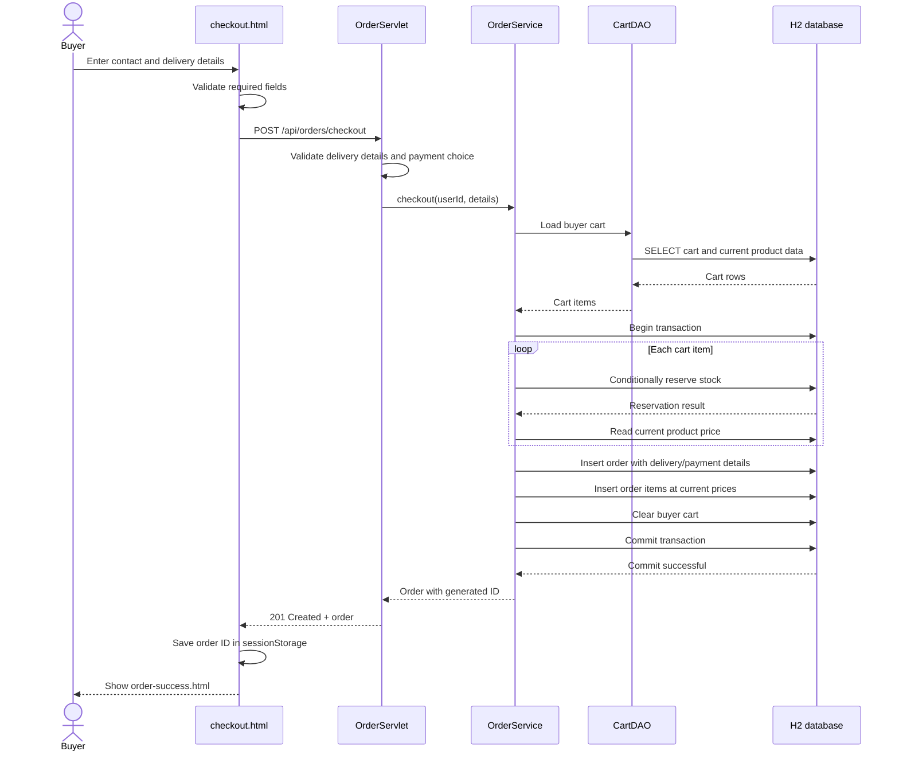

# D3 — Checkout sequence

```mermaid
sequenceDiagram
    actor Buyer
    participant UI as checkout.html
    participant API as OrderServlet
    participant Service as OrderService
    participant Cart as CartDAO
    participant DB as H2 database

    Buyer->>UI: Enter contact and delivery details
    UI->>UI: Validate required fields
    UI->>API: POST /api/orders/checkout
    API->>API: Validate delivery details and payment choice
    API->>Service: checkout(userId, details)
    Service->>Cart: Load buyer cart
    Cart->>DB: SELECT cart and current product data
    DB-->>Cart: Cart rows
    Cart-->>Service: Cart items
    Service->>DB: Begin transaction
    loop Each cart item
        Service->>DB: Conditionally reserve stock
        DB-->>Service: Reservation result
        Service->>DB: Read current product price
    end
    Service->>DB: Insert order with delivery/payment details
    Service->>DB: Insert order items at current prices
    Service->>DB: Clear buyer cart
    Service->>DB: Commit transaction
    DB-->>Service: Commit successful
    Service-->>API: Order with generated ID
    API-->>UI: 201 Created + order
    UI->>UI: Save order ID in sessionStorage
    UI-->>Buyer: Show order-success.html
```
