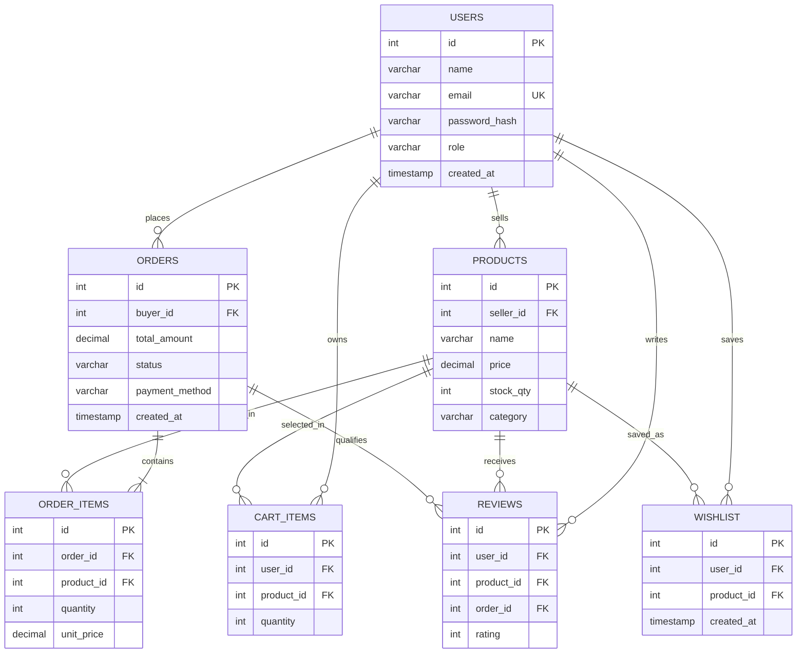

# D1 — Entity relationship diagram

```mermaid
erDiagram
    USERS ||--o{ PRODUCTS : sells
    USERS ||--o{ ORDERS : places
    USERS ||--o{ CART_ITEMS : owns
    USERS ||--o{ REVIEWS : writes
    USERS ||--o{ WISHLIST : saves
    ORDERS ||--|{ ORDER_ITEMS : contains
    PRODUCTS ||--o{ ORDER_ITEMS : appears_in
    PRODUCTS ||--o{ CART_ITEMS : selected_in
    PRODUCTS ||--o{ REVIEWS : receives
    PRODUCTS ||--o{ WISHLIST : saved_as
    ORDERS ||--o{ REVIEWS : qualifies

    USERS {
        int id PK
        varchar name
        varchar email UK
        varchar password_hash
        varchar role
        timestamp created_at
    }
    PRODUCTS {
        int id PK
        int seller_id FK
        varchar name
        decimal price
        int stock_qty
        varchar category
    }
    ORDERS {
        int id PK
        int buyer_id FK
        decimal total_amount
        varchar status
        varchar payment_method
        timestamp created_at
    }
    ORDER_ITEMS {
        int id PK
        int order_id FK
        int product_id FK
        int quantity
        decimal unit_price
    }
    CART_ITEMS {
        int id PK
        int user_id FK
        int product_id FK
        int quantity
    }
    REVIEWS {
        int id PK
        int user_id FK
        int product_id FK
        int order_id FK
        int rating
    }
    WISHLIST {
        int id PK
        int user_id FK
        int product_id FK
        timestamp created_at
    }
```

Checkout contact and delivery fields are stored on `ORDERS`; see `schema.sql` and migration `V3__checkout_details.sql`.
