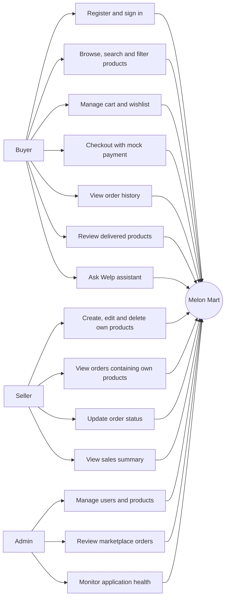

# D2 — Use-case overview

```mermaid
flowchart LR
    Buyer[Buyer]
    Seller[Seller]
    Admin[Admin]
    App((Melon Mart))

    Buyer --> B1[Register and sign in]
    Buyer --> B2[Browse, search and filter products]
    Buyer --> B3[Manage cart and wishlist]
    Buyer --> B4[Checkout with mock payment]
    Buyer --> B5[View order history]
    Buyer --> B6[Review delivered products]
    Buyer --> B7[Ask Welp assistant]

    Seller --> S1[Create, edit and delete own products]
    Seller --> S2[View orders containing own products]
    Seller --> S3[Update order status]
    Seller --> S4[View sales summary]

    Admin --> A1[Manage users and products]
    Admin --> A2[Review marketplace orders]
    Admin --> A3[Monitor application health]

    B1 --> App
    B2 --> App
    B3 --> App
    B4 --> App
    B5 --> App
    B6 --> App
    B7 --> App
    S1 --> App
    S2 --> App
    S3 --> App
    S4 --> App
    A1 --> App
    A2 --> App
    A3 --> App
```
